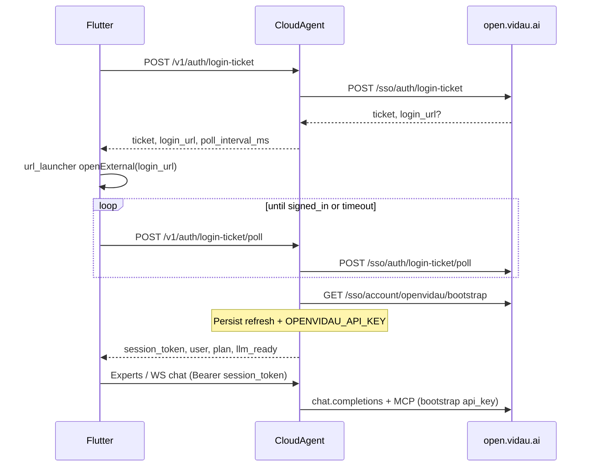

# Vidau Mobile OpenVidAU SSO → Cloud Agent LLM Key

**Date:** 2026-07-11  
**Status:** Draft for review  
**Scope:** Replace Cloud-mode demo login with browser SSO (aligned with desktop), bootstrap purchased-plan OpenVidAU API key into Cloud Agent, then use real LLM + Expert Skills/MCP.

## 1. Problem

Cloud Agent Expert loop requires an OpenAI-compatible LLM key. Today it only reads `OPENVIDAU_API_KEY` / `CLOUD_AGENT_LLM_*` / partial `~/.vidau` config. Mobile Cloud login uses a fixed `dev-local-token` and does **not** authorize the user or provision a plan-scoped key.

Desktop already does:

1. `POST /sso/auth/login-ticket` → open browser login URL  
2. Poll `POST /sso/auth/login-ticket/poll` until signed in  
3. `GET /sso/account/openvidau/bootstrap` with Bearer access token → single `provider.api_key` + models for the account/plan  
4. Persist `OPENVIDAU_API_KEY` for runtime  

Mobile must match that product path (user choice **A**: App SSO via Cloud Agent proxy; login replaces demo Cloud login).

Reference: [open.vidau.ai SSO bind](https://open.vidau.ai/sso/desktop-bind?login_ticket=lt_b494b4c2ef9984ee84f28831aee1aaf3&client=vidau-desktop), account [keys console](https://open.vidau.ai/keys) (UI only; client uses bootstrap, not `/keys` API).

## 2. Goals / Non-goals

### Goals

- One Cloud login: browser SSO → Cloud Agent session + OpenVidAU key ready.  
- Key never stored in Flutter prefs; only on Cloud Agent host.  
- `llm_config` uses bootstrap key / base_url / default_model so Expert tool-calling works.  
- After login, existing Expert install + MCP credentials + agent loop continue to work.  
- Health / UI show whether Vidau account + LLM are ready (plan optional).

### Non-goals

- Full account center / billing UI.  
- Multi-key picker (desktop also uses one bootstrap key).  
- Changing open.vidau.ai server.  
- Replacing Link-mode (desktop relay) auth.  
- Firecracker / multi-tenant isolation.

## 3. Architecture

**Trust boundary:** Phone only holds Cloud Agent session token. OpenVidAU refresh token + API key live under `cloud_agent/data/` on the Mac (or later server).

## 4. API (Cloud Agent)

Base: existing Cloud Agent (`8787`). Auth for these ticket endpoints: **none** (pre-login). Bootstrap result is bound to a newly issued Cloud session.

| Method | Path | Body / notes | Response |
|--------|------|--------------|----------|
| POST | `/v1/auth/login-ticket` | `{ "locale"?: "zh" }` | `{ ticket, login_url, poll_interval_ms, expires_in }` |
| POST | `/v1/auth/login-ticket/poll` | `{ "ticket" }` | Pending: `{ status: "pending" }` · Done: `{ status: "signed_in", session_token, user, account, llm: { configured, model, base_url }, plan }` |
| POST | `/v1/auth/logout` | Bearer session | Clears Cloud session; optional SSO logout best-effort |
| GET | `/v1/auth/me` | Bearer session | User + `llm_configured` + plan (no raw api_key) |

**SSO upstream** (same as desktop `account-auth.cjs`):

- Base: `https://open.vidau.ai` (override `CLOUD_AGENT_OPENVIDAU_BASE_URL`)  
- Client: prefer `vidau-mobile`; if ticket create fails with client error, retry `vidau-desktop`  
- Login URL: server `login_url` if present, else `{base}/login?login_ticket={ticket}&client=...` (desktop-bind URLs accepted if returned by server)  
- Bootstrap: `GET /sso/account/openvidau/bootstrap` with `Authorization: Bearer <access_token>`

**Session token:** opaque random token stored server-side (SQLite or JSON), mapped to user id + refresh token handle. Keep accepting `dev-local-token` only when `CLOUD_AGENT_ALLOW_DEV_TOKEN=1` for automated tests.

## 5. Persistence (Cloud Agent host)

| File | Contents |
|------|----------|
| `data/account_auth.json` | refresh_token (file mode 0600), user, account.plan/status, base_url, updated_at — **no api_key** |
| `data/openvidau.env` | `OPENVIDAU_API_KEY`, `OPENVIDAU_BASE_URL`, `VIDAU_USER_ID`, optional `OPENVIDAU_DEFAULT_MODEL` |
| `data/sessions.db` or `data/cloud_sessions.json` | `session_token` → user_id, created_at |

`llm_config.resolve_llm_config()` priority:

1. Explicit `CLOUD_AGENT_LLM_*`  
2. `data/openvidau.env` (SSO bootstrap)  
3. Process env `OPENVIDAU_API_KEY`  
4. `~/.vidau` config + env (dev convenience only; not required for mobile path)

On bootstrap success, also set in-memory settings used by agent_loop so restart without re-login still works if files present. On startup, if `account_auth.json` has refresh_token, refresh + re-bootstrap opportunistically (best-effort; failure → `llm_configured: false` until user logs in again).

## 6. Flutter changes

- **LoginPage (Cloud):** button「使用 Vidau 账号登录」→ `startVidauSso()`: request ticket, `url_launcher` / `LaunchMode.externalApplication`, poll until `signed_in` or timeout (~5 min), store `session_token` in `AuthStore`, navigate to experts.  
- Remove Cloud reliance on hardcoded `dev-local-token` for normal UX (tests may still inject).  
- **AuthController:** new SSO methods; health check still required before ticket (wrong `CLOUD_HOST` fails fast).  
- **CloudClient:** pass stored session token on all API/WS calls.  
- **Experts / chat:** if `llm_configured` false after login edge case, show「重新登录 Vidau」; MCP Key install flow unchanged.  
- Display plan / model from `/v1/auth/me` or poll response in AppBar or experts header (lightweight).

Link mode login unchanged.

## 7. Acceptance

1. Cold start Cloud mode → SSO browser → after sign-in, `/health` or `/v1/auth/me` shows `llm_configured: true` and a model.  
2. Send chat on TikTok Expert (with MCP key if needed) → agent loop calls LLM; reply is **not** “未配置可用 LLM” and **not** `Mock create_campaign succeeded`.  
3. API key never appears in Flutter logs or AuthStore.  
4. Logout clears Cloud session; subsequent chat unauthorized until login.  
5. Unit tests: mock SSO HTTP for ticket/poll/bootstrap; llm_config reads `openvidau.env`.

## 8. Implementation sketch (files)

**Backend (worktree `cloud-agent-p0`):**

- `cloud_agent/app/openvidau_sso.py` — ticket, poll, refresh, bootstrap client  
- `cloud_agent/app/account_store.py` — persist auth + env + session tokens  
- `cloud_agent/app/llm_config.py` — load `data/openvidau.env`  
- `cloud_agent/app/main.py` — auth routes; tighten `verify_token`  
- `cloud_agent/app/auth.py` — session validation  
- Tests under `cloud_agent/tests/test_openvidau_sso.py`

**Flutter:**

- `lib/state/auth_controller.dart`, `login_page.dart`  
- `lib/cloud/cloud_api_client.dart` — ticket/poll/me  
- `url_launcher` dependency if missing  
- Wire token into `CloudClient` / providers

**Docs:** update `cloud_agent/README.md` SSO section.

## 9. Risks

| Risk | Mitigation |
|------|------------|
| Server rejects `vidau-mobile` client | Fallback to `vidau-desktop` |
| Poll timeout / user closes browser | Clear error + Retry on login page |
| Bootstrap without api_key (unpaid) | Surface plan/status error; do not fake LLM |
| LAN Cloud Agent + phone browser SSO | SSO is on public open.vidau.ai; only ticket APIs need LAN to Mac |

## 10. Open questions (resolved)

| Question | Decision |
|----------|----------|
| Where does SSO live? | App via Cloud Agent proxy (A) |
| Login placement? | Replaces Cloud demo login (1) |
| Success criteria | Key ready → cloud LLM + Skills/MCP usable |
